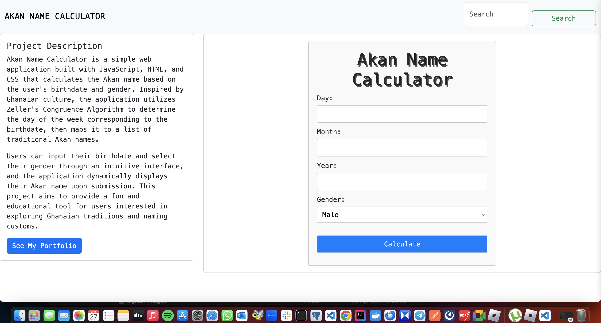

## Sneak Peek



# Akan Name Calculator

## Description

> Akan Name Calculator is a simple web application built with JavaScript, HTML, and CSS that calculates the Akan name based on the user's birthdate and gender. Inspired by Ghanaian culture, the application utilizes Zeller's Congruence Algorithm to determine the day of the week corresponding to the birthdate, then maps it to a list of traditional Akan names. Users can input their birthdate and select their gender through an intuitive interface, and the application dynamically displays their Akan name upon submission. This project aims to provide a fun and educational tool for users interested in exploring Ghanaian traditions and naming customs.

## Live Demo Link

[Live Link]()

## Built With


## Get Started

### Run

```
To get a clone of the project, run `https://github.com/odhiambo-ed/moringa-vanillajs-age-calculator.git`
```

```
cd /moringa-vanillajs-age-calculator
```

```
npm install
```

```
npm run dev
```


## Author(s)

  <a href="https://github.com/odhiambo-ed" target="blank"></a>   **Edward Odhiambo**

- GitHub: [@whit3d](https://github.com/odhiambo-ed)
- Twitter: [@odhiambo_ed](https://twitter.com/odhiambo_ed)
- LinkedIn: [Edward Odhiambo](https://www.linkedin.com/in/edward-odhiambo/)
- Portfolio: [Edward Odhiambo](https://edwardodhiambo.com/)

## 🤝 Contributing

Contributions, issues, and feature requests are welcome!!!

Feel free to check the [issues page]https://github.com/odhiambo-ed/edward-portfolio-moringa/issues)

## Show your support

Give a ⭐️ if you like this project!

## Acknowledgments

- Hat tip to anyone whose code was used
- Special thanks to [Christian Zeller](https://en.wikipedia.org/wiki/Zeller%27s_congruence#:~:text=Zeller's%20congruence%20is%20an%20algorithm,day%20and%20the%20calendar%20date.) for developing the Congruence Algorithm, which forms the foundation of the date calculation method used in this project.
## 📝 License

This project is [MIT](https://github.com/white3d/GitHub-User-Content/blob/main/LICENSE) licensed.

